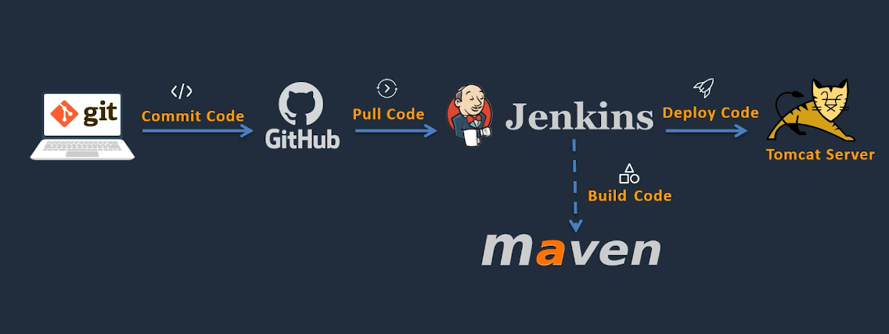
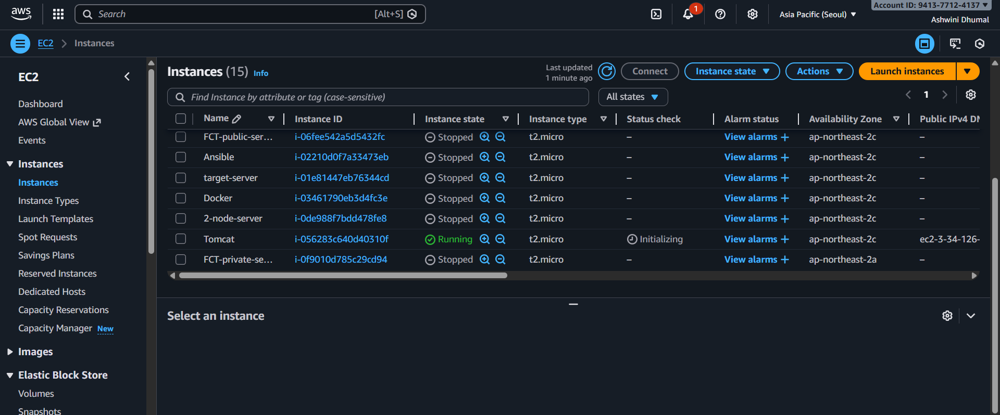
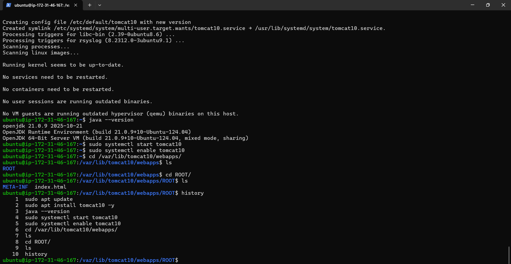
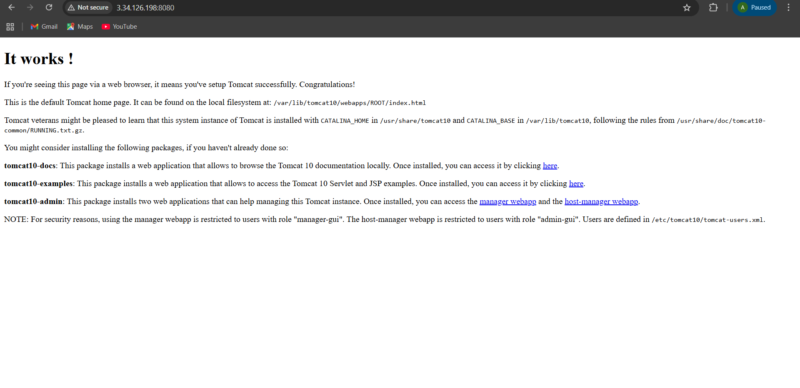
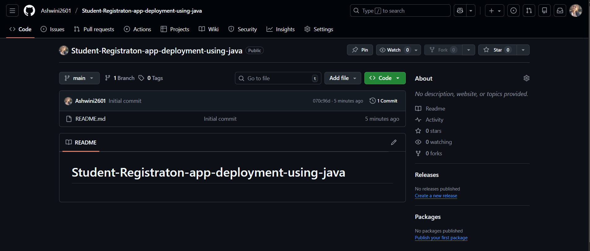
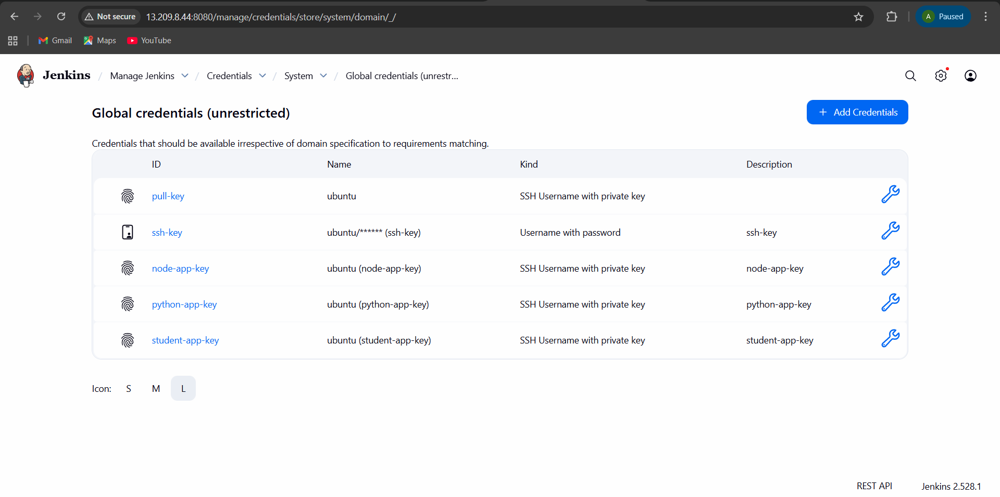
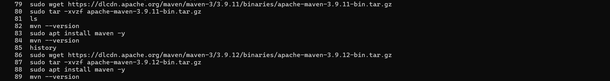
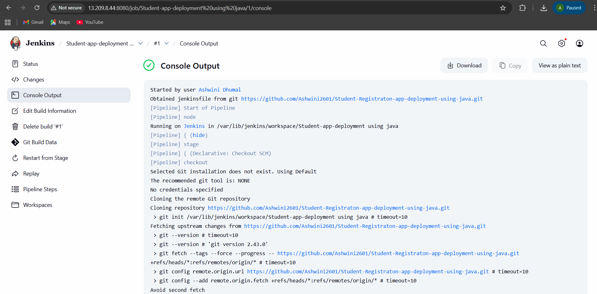
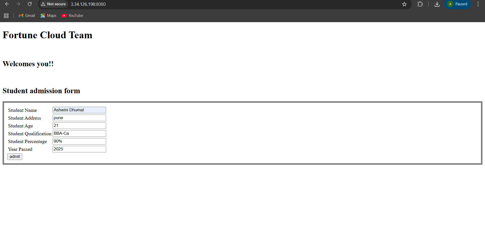

## Student Registration App Deployment using Java (Jenkins + Tomcat)
### Project Overview

#### This project demonstrates deployment of a Java-based Student Registration Application using:

1. Jenkins CI/CD
2. Apache Tomcat 10
3. Maven
4. GitHub repository

### Architecture
#### Explanation:

1. Developer pushes code to GitHub.
2. Jenkins is triggered automatically via Git push.
3. Jenkins executes Maven build, creates a WAR file, and deploys it via SSH to Tomcat server.
4. Tomcat serves the Student Registration App to any browser.



### Technologies & Platforms

1. AWS EC2 – Jenkins & Tomcat servers
2. Ubuntu – Server OS
3. GitHub – Version control
4. Jenkins – CI/CD tool
5. Java 11 / 17 – Application runtime
6. Apache Tomcat 10 – Application server
7. Maven – Build tool

### Deployment Steps:

### Step 1: Launch Two EC2 Instances

   1. Jenkins Server (EC2-1)
  2. Tomcat Server (EC2-2)
   
   #### Security Groups :

  | Port | Purpose          |
| ---- | ---------------- |
| 22   | SSH              |
| 8080 | Jenkins / Tomcat |



### Step 2: Login to Tomcat Server and Install Tomcat

 1. sudo apt update
 2. sudo apt install tomcat10 -y
 3. java --version
 4. sudo systemctl start tomcat10
 5. sudo systemctl enable tomcat10
 6. cd /var/lib/tomcat10/webapps/
 7. ls
8. cd ROOT/
9. ls



#### Check the default Tomcat page:http://<TOMCAT-EC2-IP:8080/



### Step 3: Create & Clone GitHub Repository
  1. Create a new repository: Python-app-deployment-using-CICD-pipeline



 2. Clone repository on local machine:

    1. git clone https://github.com//Python-app-deployment-using-CICD-pipeline.git
    2. cd Python-app-deployment-using-CICD-pipeline

### Step 4: Create Jenkins Credentials
1. Go to Manage Jenkins → Credentials → Global → Add Credentials

2. Add SSH key for EC2:

   1. Kind: SSH Username with private key
   2. Username: ubuntu
   3. Private Key: paste key or choose file
   4. ID: student-app-key

   

### Step 5: Jenkins Configuration Files

#### 1. Jenkinsfile: 
```
pipeline {
    agent any

    environment {
        SERVER_IP    = '3.34.126.198'
        SSH_CRED_ID  = 'student-app-key'
        TOMCAT_PATH  = '/var/lib/tomcat10/webapps'
        TOMCAT_SVC   = 'tomcat10'
    }

    stages {
        stage('Checkout') {
            steps {
                git branch: 'main', url: 'https://github.com/Ashwini2601/Student-Registraton-app-deployment-using-java.git'
            }
        }

        stage('Build WAR') {
            steps {
                sh 'mvn clean package'
            }
        }

        stage('Deploy to Tomcat') {
            steps {
                sshagent([SSH_CRED_ID]) {
                    sh """
                        WAR_FILE=\$(ls target/*.war | head -n 1)
                        scp -o StrictHostKeyChecking=no \$WAR_FILE ubuntu@${SERVER_IP}:/tmp/
                        ssh -o StrictHostKeyChecking=no ubuntu@${SERVER_IP} '
                            sudo rm -rf ${TOMCAT_PATH}/*
                            sudo mv /tmp/*.war ${TOMCAT_PATH}/ROOT.war
                            sudo chown tomcat:tomcat ${TOMCAT_PATH}/ROOT.war
                            sudo systemctl restart ${TOMCAT_SVC}
                        '
                    """
                }
            }
        }
    }

    post {
        success {
            echo "App deployed! Visit: http://${SERVER_IP}:8080/"
        }
        failure {
            echo "Deployment failed."
        }
    }
}
```
#### 2. Commit & Push Code

   1. git add .
   2. git commit -m "added Jenkinsfile"
   3. git push -u origin main

### Step 6: Install Maven on Jenkins Server (EC2-1)
1. Login to Jenkins EC2 server:
2. Install maven:

    1. sudo wget https://dlcdn.apache.org/maven/maven-3/3.9.12/binaries/apache-maven-3.9.12-bin.tar.gz
   2. sudo tar -xvzf apache-maven-3.9.12-bin.tar.gz
   3. sudo apt install maven -y
    4. mvn --version

    

#### Step 7: Create Jenkins Pipeline Job  

1.  Jenkins → New Item → Pipeline
2. Name: Student-App-Deployment
3. Pipeline Definition: Pipeline script from SCM → Git

4. Add repository URL, branch, credentials (tomcat-key)

5. Save → Build Now
6. Check Console Output



### Step 8: Test Deployment

#### Access app in browser:http://<TOMCAT-EC2-IP:8080/



#### You should see the Student Registration App home page instead of the default Tomcat page.